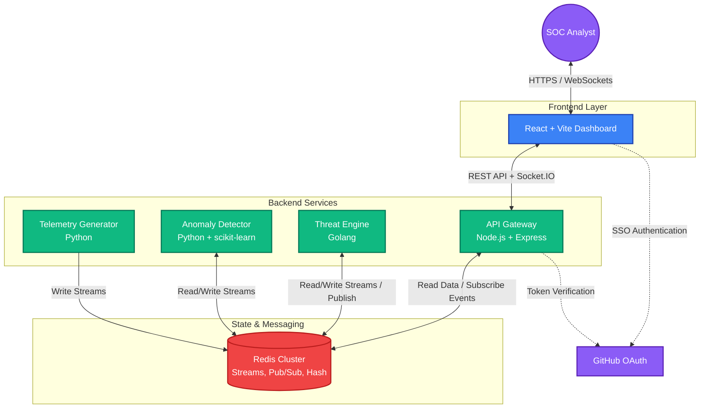
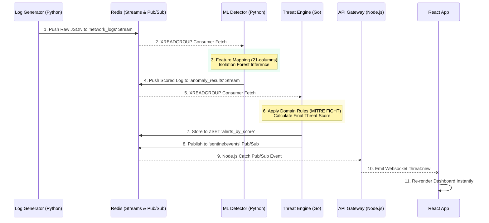
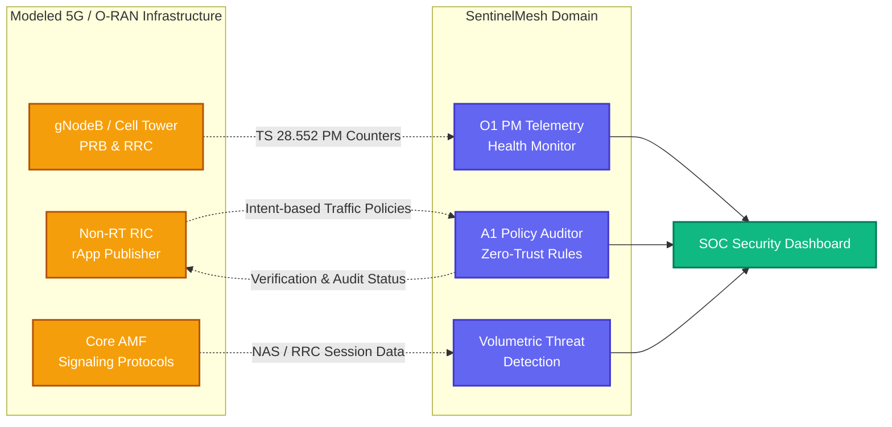
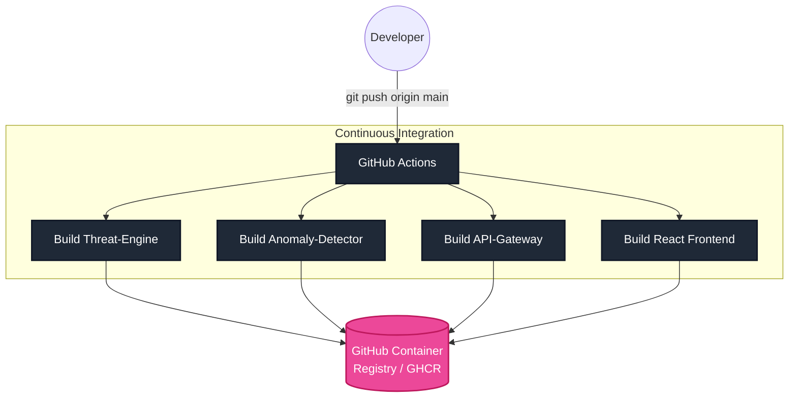

# 🛡️ SentinelMesh — AI-Powered Network & O-RAN Security Platform

<div align="center">

**Real-time threat detection, MITRE ATT&CK + FiGHT classification, and Zero-Trust A1 policy auditing for enterprise network and Open RAN environments.**

[](https://nodejs.org/)
[](https://golang.org/)
[](https://python.org/)
[](https://react.dev/)
[](https://docs.docker.com/compose/)
[](https://redis.io/)
[](https://socket.io/)
[](LICENSE)

</div>

---

## 📸 Platform Interface

### Interactive SOC Dashboard


### Anomaly Detection & Threat Mapping


### Zero-Trust O-RAN Policy Audit


### Secure GitHub OAuth Login


---

## 📡 Overview

SentinelMesh is a polyglot microservices platform that performs **real-time network intrusion detection** and **O-RAN (Open RAN) security assurance**. It combines ML-based anomaly detection (Isolation Forest), a Go threat scoring engine, and a React SOC dashboard with real-time WebSocket updates.

### What Makes This Enterprise-Grade

| Feature | Implementation |
|---------|---------------|
| **MITRE ATT&CK + FiGHT** | 11 threat classifications (5 network + 5 telecom + normal) mapped to MITRE techniques |
| **O-RAN Security** | A1 policy audit engine, O1 PM telemetry, RAN cell health monitoring |
| **Zero-Trust Policy Audit** | Validates A1 policies against O-RAN TS 803, 3GPP TS 33.501, NIST SP 800-187 |
| **Real-time Streaming** | Socket.IO bidirectional events + Redis Streams message bus |
| **ML Pipeline** | Isolation Forest anomaly detection with feature engineering |
| **Security Posture** | Aggregated risk score across 6 compliance areas |
| **Observability** | Prometheus metrics, structured logging (Pino), health endpoints |
| **Authentication** | GitHub OAuth 2.0 + JWT sessions + rate limiting |

---

## 🏗️ Architecture



### Event-Driven Data Flow

 
### O-RAN (Open RAN) Security Integration Model


### GitOps CI/CD Pipeline Flow


---

## 🚀 Key Features

### 🔐 Network Security
- **ML Anomaly Detection** — Isolation Forest model trained on network traffic features
- **Real-time Threat Feed** — Socket.IO push for instant alert visibility
- **Threat Intelligence Map** — SVG geo-visualization of attack origins
- **Protocol Analysis** — TCP/UDP/ICMP/DNS distribution + port targeting

### 📡 O-RAN Security Assurance
- **5 Telecom Attack Types** — Rogue gNB, handover hijack, signaling storm, slice access violation, IMSI catcher
- **O1 PM Counters** — PRB utilization, RRC setup rate, handover success, RSRP/SINR/CQI, throughput, latency
- **A1 Policy Audit** — Zero-trust validation against O-RAN TS 803, 3GPP TS 33.501, NIST SP 800-187
- **Security Posture Score** — 0-100 aggregated risk assessment across 6 compliance areas
- **Network Slice Monitoring** — eMBB, URLLC, mMTC, Emergency slice status
- **8 Simulated gNB Cells** — CU/DU architecture with n77/n78/n258/n41 bands

### 📊 MITRE Classification
- **ATT&CK Framework** — T1110 (Brute Force), T1046 (Discovery), T1071 (C2), T1498 (DoS)
- **FiGHT Framework** — FGT1583 (Rogue BS), FGT1599 (Handover Hijack), FGT1498 (Signaling DoS), FGT1562 (Slice Bypass), FGT1040 (IMSI Intercept)
- **Mitigations** — 3GPP TS 33.501, O-RAN WG11, NIST SP 800-187 mapped

### 🖥️ SOC Dashboard
- **12-column responsive grid** with glassmorphism design
- **Animated stat counters** with delta trend indicators
- **Severity donut chart** (pure SVG, no chart library)
- **Threat heatmap** (hour × day matrix)
- **System health monitor** showing all 6 microservices
- **Investigation panel** with O-RAN context and MITRE chain visualization
- **Sidebar navigation** with Overview and O-RAN dedicated views

---

## 🛠️ Tech Stack

| Layer | Technology | Purpose |
|-------|-----------|---------|
| **Frontend** | React 18 + Vite | SOC dashboard SPA |
| **UI** | Custom CSS + Lucide Icons + Recharts | Enterprise SOC theme |
| **API** | Express.js + Socket.IO | REST API + real-time events |
| **ML Service** | Python + scikit-learn | Isolation Forest anomaly detection |
| **Threat Engine** | Go | High-performance scoring & classification |
| **Data Generator** | Python | Network + O-RAN event simulation |
| **Message Bus** | Redis Streams | Async microservice communication |
| **Cache** | Redis | Stats aggregation, sorted sets, lists |
| **Auth** | GitHub OAuth 2.0 + JWT | Identity + session management |
| **Logging** | Pino (structured) | JSON logging with correlation |
| **Metrics** | Prometheus-compatible | `/api/metrics` endpoint |
| **Infra** | Docker Compose | Multi-container orchestration |

---

## 💻 Quick Start

### Prerequisites
- Docker & Docker Compose
- Node.js 18+ (for local dev)
- Go 1.21+ (for local dev)
- Python 3.11+ (for local dev)

### Docker (Recommended)

```bash
git clone https://github.com/yourusername/sentinelmesh.git
cd sentinelmesh

# Copy and configure environment
cp .env.example .env

# Launch all services
docker compose up --build
```

### Local Development

```bash
# Terminal 1: Redis
docker run -p 6379:6379 redis:7-alpine

# Terminal 2: Log Generator
cd services/log-generator && pip install redis && python main.py

# Terminal 3: Anomaly Detector
cd services/anomaly-detector && pip install redis scikit-learn numpy && python main.py

# Terminal 4: Threat Engine
cd services/threat-engine && go run main.go

# Terminal 5: API Gateway
cd services/api-gateway && npm install && node server.js

# Terminal 6: Dashboard
cd frontend/dashboard && npm install && npm run dev
```

### Access
- **Dashboard**: http://localhost:5173
- **API Gateway**: http://localhost:3001
- **Health Check**: http://localhost:3001/api/health
- **Metrics**: http://localhost:3001/api/metrics

---

## 📂 Repository Structure

```
sentinelmesh/
├── services/
│   ├── log-generator/         # Python — Network + O-RAN event simulation
│   │   └── main.py            # 10 event types + O1 telemetry + A1 policies
│   ├── anomaly-detector/      # Python — ML anomaly detection pipeline
│   │   └── main.py            # Isolation Forest with feature engineering
│   ├── threat-engine/         # Go — High-performance threat scoring
│   │   └── main.go            # Network + telecom classification
│   └── api-gateway/           # Node.js — REST/WebSocket API
│       └── server.js          # OAuth, MITRE, O-RAN endpoints
├── frontend/
│   └── dashboard/             # React 18 — SOC Dashboard
│       └── src/
│           ├── components/    # 14 visualization components
│           ├── pages/         # Dashboard, Login, AuthCallback
│           └── context/       # AuthContext with Socket.IO
├── infra/
│   └── docker-compose.yml     # Multi-container orchestration
├── .env.example               # Environment configuration
└── README.md                  # This file
```

---

## 🔌 API Endpoints

### Authentication
| Method | Endpoint | Description |
|--------|----------|-------------|
| GET | `/auth/github` | Initiate GitHub OAuth flow |
| GET | `/auth/github/callback` | OAuth callback handler |
| POST | `/auth/demo` | Demo login (no OAuth needed) |
| GET | `/auth/verify` | Verify JWT token |

### Security Data
| Method | Endpoint | Description |
|--------|----------|-------------|
| GET | `/api/stats` | Dashboard statistics |
| GET | `/api/alerts` | Threat alerts (sorted by score) |
| GET | `/api/attackers` | Top attacker IPs |
| GET | `/api/traffic` | Recent traffic entries |
| GET | `/api/anomalies` | Anomaly timeline data |
| GET | `/api/topology` | Network topology nodes/edges |
| GET | `/api/mitre` | MITRE ATT&CK + FiGHT mappings |

### O-RAN
| Method | Endpoint | Description |
|--------|----------|-------------|
| GET | `/api/oran/telemetry` | O1 PM counters for all gNB cells |
| GET | `/api/oran/policies` | A1 policies with risk scoring |
| POST | `/api/oran/policies/audit` | Zero-trust policy validation |
| GET | `/api/oran/slices` | Network slice status |
| GET | `/api/oran/posture` | Security posture score |

### Operations
| Method | Endpoint | Description |
|--------|----------|-------------|
| GET | `/api/health` | Health check (no auth) |
| GET | `/api/metrics` | Prometheus metrics (no auth) |

---

## 📡 O-RAN Domain Details

### Simulated RAN Infrastructure
| Cell ID | Type | Band | Location |
|---------|------|------|----------|
| gNB-CU-001 | Macro | n78 | Downtown Core Sector 1 |
| gNB-CU-002 | Macro | n78 | Downtown Core Sector 2 |
| gNB-CU-003 | Macro | n78 | Downtown Core Sector 3 |
| gNB-DU-101 | Small Cell | n258 | Westfield Mall |
| gNB-DU-102 | Small Cell | n258 | City Stadium |
| gNB-DU-103 | Small Cell | n77 | Central Hospital |
| gNB-CU-004 | Rural | n41 | Highway A1 Sector 1 |
| gNB-CU-005 | Rural | n41 | Highway A1 Sector 2 |

### Network Slices
| Slice | SST | Purpose |
|-------|-----|---------|
| SLICE-eMBB-01 | 1 | Enhanced Mobile Broadband |
| SLICE-URLLC-01 | 2 | Ultra-Reliable Low Latency |
| SLICE-mMTC-01 | 3 | Massive Machine Type Comm |
| SLICE-EMRG-01 | 5 | Emergency Services |

### Telecom Attack Classifications

| Event Type | MITRE FiGHT | Description |
|-----------|-------------|-------------|
| `rogue_basestation` | FGT1583.501 | Fake gNB impersonation → MITM |
| `handover_hijack` | FGT1599.001 | A3-Event offset manipulation |
| `signaling_storm` | FGT1498.502 | NAS/RRC flooding on AMF |
| `unauthorized_slice_access` | FGT1562.501 | S-NSSAI boundary violation |
| `imsi_catcher` | FGT1040.501 | 5G→4G downgrade + SUPI capture |

### Policy Audit Standards
- **O-RAN TS 803** — Security Requirements (Zero-Trust)
- **3GPP TS 33.501** — 5G System Security Architecture
- **3GPP TS 33.813** — Network Slice Security
- **NIST SP 800-187** — 5G Cybersecurity
- **O-RAN WG11** — Security Threat Modeling

---

## 🧪 Development

### Run Tests
```bash
# Backend tests (when available)
cd services/anomaly-detector && pytest tests/

# Frontend lint
cd frontend/dashboard && npm run lint
```

### Environment Variables
```env
REDIS_HOST=localhost
REDIS_PORT=6379
JWT_SECRET=your-secret-key
GITHUB_CLIENT_ID=your-github-client-id
GITHUB_CLIENT_SECRET=your-github-client-secret
GITHUB_CALLBACK_URL=http://localhost:3001/auth/github/callback
FRONTEND_URL=http://localhost:5173
```

---

## 📄 License

MIT License — see [LICENSE](LICENSE) for details.

---

<div align="center">

**Built with ❤️ for enterprise security operations**

*SentinelMesh demonstrates proficiency in microservice architecture, real-time data streaming, ML-based threat detection, O-RAN security assurance, and production-grade DevOps practices.*

</div>
